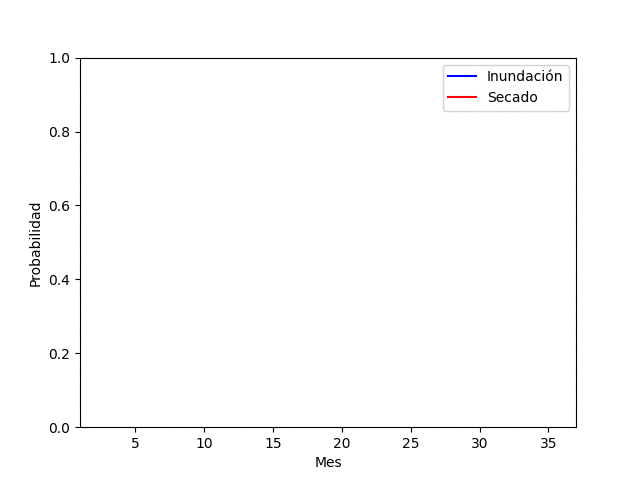

# Trabajo Final de Modelos de Sistemas Biológicos - FIUNER 2024

Este repositorio contiene el trabajo final, llevado a cabo por Garcia Justo, para el de Modelos de Sistemas Biológicos de la Facultad de Ingeniería de la Universidad Nacional de Entre Ríos (FIUNER) del año 2024.

## Descripción
En este proyecto se incluye una presentación de diapositiva desarrollado en el artículo referenciado [1] y el código desarrollado en él con un aporte creativo de elaboración propia.

La región de Entre Ríos, Argentina, se caracteriza por su red de ríos y la frecuencia con la que se presentan inundaciones que afectan tanto a las poblaciones humanas como a los ecosistemas en general. Este es un fenómeno recurrente para nuestra región, de gran influencia sobre la dinámica. En este contexto, se propone una modificación del código del paper referenciado para incluir celdas que simulen ríos y los procesos de inundación y sequía que se dan estacionariamente.

Incorporar la dinámica de inundaciones, es una forma de añadir heterogeneidad que refleja mejor las condiciones de nuestra provincia. Podría enriquecer la comprensión de como estas perturbaciones periódicas, afectan la diversidad y estructura de las comunidades vegetales.

Un refinamiento de estos modelos podría constituir una herramienta para gestión de recursos en regiones vulnerables a las inundaciones.

Dados los tiempos de desarrollos que implicaría se reconocen las siguientes limitaciones:
- La dinámica del río podría constituir un modelo aparte.
- No se considero que la presencia de una inundación altere la disponibilidad de recursos.
- Se considera a la inundación solo como la imposibilidad de crecer una planta.
- No se llevó a cabo un ajuste de parámetros.
    - Solo se tuvo en cuenta área de cobertura de la inundación y duración de la misma.
- Se consideró cada iteración como un mes. 

La estacionariedad del fenómeno se implementó con ondas senoidales que representan la probabilidad de inundar o secar. A continuación se muestra una representación para tres años: 



Podría ser interesante tambien añadir un aleatoriedad en algún término del cálculo de estas probabilidades para simular los cambios que hay de un año a otro.

## Contenido del Repositorio
- *InformacionSuplementaria/*
    - ***C-S-R Explanation.pdf***: Información complementaria con desprición de clasificación C-S-R.
- ***csr.py***: Script de python con las implementaciones mencionadas previamente.
- ***CSRCAOOPRR.ipynb***: Código del artículo.
- ***Diapositivas.pdf***: Presentación de diapositivas utilizada durante la defensa del trabajo.
- ***Paper.pdf***: Artículo referenciado.
- ***requirements.txt***: Archivo de requerimientos.


## Uso
1. Clona el repositorio

    ```bash
    git clone 
    ```

2. Navega al directorio
    ```bash
    cd TIF-MSB
    ```

3. Instala las dependencias
    ```bash
    pip install -r requirements.txt
    ```

4. Ejecuta el script de python
    ```
    python3 csr.py
    ```

## Referencias
1. Hunt, R., & Colasanti, R. L. (2021). Real communities of virtual plants explain biodiversity on just three assumptions. in silico Plants, 3(1), diab015. https://doi.org/10.1093/insilicoplants/diab015

-----
**Autor**: Garcia Justo


